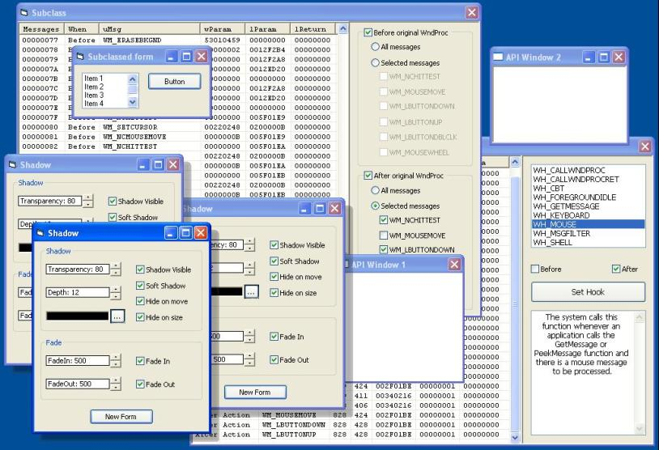



## Updated 3/07 \-  VB\+ASM Subclass, Hook, Timer, Api\-Window class thunks, w/ Form fade/shadow sample

### Description

Superceded by this submission

http://www.planet-source-code.com/vb/scripts/showcode.asp?txtCodeId=51403&lngWId=1

Updated 3/07 - Just minor stuff --- My cSuperClass submission's download link appears broken so I thought it was about time I made a new entry. Just as Vlad Vissoultchev's excellent subclasser built on mine and added a hooking thunk, I've done likewise and added timer and api-windows thunks.

Each of the thunks has an individual sample to demonstrate its use.

If you're blessed with Windows 2000 or Windows XP check out the form shadow/fade user control.

Credits:

Thanks to Clint LaFever for the idea of a form shadow.

http://www.exhedra.com/vb/scripts/ShowCode.asp?txtCodeId=42148&lngWId=1

Thanks to Vlad for his superb subclass/hook thunks

http://www.exhedra.com/vb/scripts/ShowCode.asp?txtCodeId=40518&lngWId=1
 
### More Info
 

             |
---                |---
**Submitted On**   |2003-03-07 11:11:10
**By**             |[Paul Caton](https://github.com/Planet-Source-Code/PSCIndex/blob/master/ByAuthor/paul-caton.md)
**Level**          |Intermediate
**User Rating**    |5.0 (355 globes from 71 users)
**Compatibility**  |VB 5\.0, VB 6\.0
**Category**       |[Miscellaneous](https://github.com/Planet-Source-Code/PSCIndex/blob/master/ByCategory/miscellaneous__1-1.md)
**World**          |[Visual Basic](https://github.com/Planet-Source-Code/PSCIndex/blob/master/ByWorld/visual-basic.md)
**Archive File**   |[Updated\_3\_155578372003\.zip](https://github.com/Planet-Source-Code/paul-caton-updated-3-07-vb-asm-subclass-hook-timer-api-window-class-thunks-w-form-fade-sha__1-42918/archive/master.zip)

